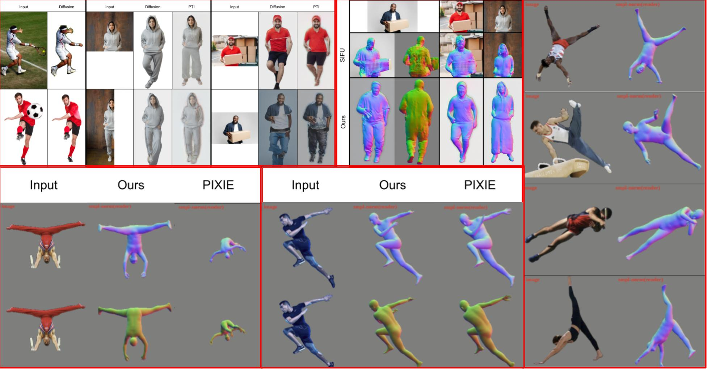

<div align="center">

<h1>AvatarsFTW: 3D Human Avatars From The Wild</h1>

<div>
    <a href="https://adithyaknarayan.github.io/" target="_blank">Adithya Narayan</a>&emsp;
    <a href="http://www.kaustavmukherjee.com/" target="_blank">Kaustav Mukherjee</a>&emsp;
    <a href="" target="_blank">Shaurye Agarwal</a>&emsp;
</div>

<div>
    <a href="https://visual-learning.cs.cmu.edu/" target="_blank">16-824: Visual Learning And Recognition Project </a>
</div>


<div style="width: 80%; text-align: center; margin:auto;">
    
    <em>Figure 1. 
        We propose a two-part, inpainting and body fitting pipeline that alleviates 3D human reconstruction issues with human-object interactions, occlusions, and dynamic poses. The inpainting pipeline uses keypoint detection and a novel keypoint estimation technique, uses LaMa for occluding object removal, Stable Diffusion with ControlNets for generation of missing areas, and a GAN inversion step to create a seamless, plausible human reconstruction. The body fitting pipeline uses an improved regressor and adds more losses to the iterative fitting stage to achieve a better human mesh fit in dynamic poses. The figure above demonstrates our work's ability to inpaint human images, generate improved meshes for incomplete images, and fit better human meshes to a variety of highly dynamic poses.</em>
</div>

Note: This repository is borrows heavily from the codebase of the original SIFU paper (https://github.com/River-Zhang/SIFU). All credits to them for the overall structure of the codebase and the utility functions we build upon. A lot of the work we've done for this project builds directly on top of this repository. For a list of changes, please refer below.


<div align="left">


# Changelog 
- Added distance transform based loss and sobel based loss inspired by [K-Body](https://arxiv.org/pdf/2304.11542)
- Integrated the **updated** version of [PyMAF-X](https://github.com/HongwenZhang/PyMAF-X) into the repository.
- Added inpainting pipeline to remove objects and occlusions.

# Installation
- Ubuntu 20 / 18
- **CUDA=11.6 or 11.7 or 11.8, GPU Memory > 16GB**
- Python = 3.8
- PyTorch = 1.13.0 (official [Get Started](https://pytorch.org/get-started/locally/))

We thank @[levnikolaevich](https://github.com/levnikolaevich) and @[GuangtaoLyu](https://github.com/GuangtaoLyu) for provide valuable advice on the installation steps.


If you don't have conda or miniconda, please install that first:
```bash
sudo apt-get update && \
sudo apt-get upgrade -y && \
sudo apt-get install unzip libeigen3-dev ffmpeg build-essential nvidia-cuda-toolkit

mkdir -p ~/miniconda3 && \
wget https://repo.anaconda.com/miniconda/Miniconda3-latest-Linux-x86_64.sh -O ~/miniconda3/miniconda.sh && \
bash ~/miniconda3/miniconda.sh -b -u -p ~/miniconda3 && \
rm -rf ~/miniconda3/miniconda.sh && \
~/miniconda3/bin/conda init bash && \
~/miniconda3/bin/conda init zsh

```


```bash
# close and reopen the shell
git clone https://github.com/River-Zhang/SIFU.git
sudo apt-get install libeigen3-dev ffmpeg
cd SIFU
conda env create -f environment.yaml
conda activate sifu
pip install -r requirements.txt

```


Please download the [checkpoint (google drive)](https://drive.google.com/file/d/13rNSmQI_VaMtwlMBSUaxEGybzJEl5KTi/view?usp=sharing) and place them in ./data/ckpt

Please follow [ICON](https://github.com/YuliangXiu/ICON/blob/master/docs/installation.md) to download the extra data, such as HPS and SMPL (using ```fetch_hps.sh``` and ```fetch_data.sh```). There may be missing files about SMPL, and you can download from [here](https://huggingface.co/lilpotat/pytorch3d/tree/main/smpl_data) and put them in /data/smpl_related/smpl_data/.

Additonally, please follow the instuctions on PyMAF-X and setup the data directory in `test/SIFU/data/HPS/pymafx_data`.
# Inference

To test the pipeline on the original baseline mentioned in the SIFU paper, please run the following.
```bash


python -m apps.infer -cfg ./configs/sifu.yaml -gpu 0 -in_dir ./examples -out_dir ./results -loop_smpl 100 -loop_cloth 200 -hps_type pixie

```

To run our updated model, please run the following.
```bash


python -m apps.infer -cfg ./configs/sifu.yaml -gpu 0 -in_dir ./examples -out_dir ./results -loop_smpl 100 -loop_cloth 200 -hps_type pymafx

```
Optionally, we have also debugged a few things to allow for PyMAF to run smoothly. Note that this is a slightly older version as implmented in the original SIFU repository.
```bash


python -m apps.infer -cfg ./configs/sifu.yaml -gpu 0 -in_dir ./examples -out_dir ./results -loop_smpl 100 -loop_cloth 200 -hps_type pymafx

```
# Inpainting

To install and run the inpainting pipeline, refer to the README file in the Inpainting folder and follow those instructions.
 
# Testing

```bash
# 1. Register at http://icon.is.tue.mpg.de/ or https://cape.is.tue.mpg.de/
# 2. Download CAPE testset
bash fetch_cape.sh 

# evaluation
python -m apps.train -cfg ./configs/train/sifu.yaml -test

# TIP: the default "mcube_res" is 256 in apps/train.
```

# Texture Refinement Module

The code is available for download on [google drive](https://drive.google.com/file/d/1GOpo8enZTWsaWMn_liPnPNmkaUeNsqJk/view?usp=sharing). Please note that the current code structure may not be well-organized and may require some time to set up the environment. The author plans to reorganize it at their earliest convenience.
